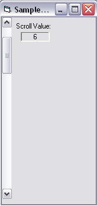

<div align="center">

## XP Style Scroll Control


</div>

### Description

Sick of those ugly VB 6 scroll bars that don't support XP themes? Don't feel like messing with a manifest? Here is the code for you. This scrollbar control acts just like the XP scroll bar on a multi-line text box because it is. The control just uses an API call and a timer to expose the scroll event of the textbox and then hides the textbox. This means you get allot of functionality with very little code. There is room for improvement and additions, but I wanted to keep the code as simple as I could.
 
### More Info
 
Leave a little width on the control instance in the designer so you can drag and resize it. The designer does not seem to detect click events on the textbox scrollbar.


<span>             |<span>
---                |---
**Submitted On**   |2006-02-25 19:38:56
**By**             |[archetech](https://github.com/Planet-Source-Code/PSCIndex/blob/master/ByAuthor/archetech.md)
**Level**          |Intermediate
**User Rating**    |3.5 (21 globes from 6 users)
**Compatibility**  |VB 5\.0, VB 6\.0
**Category**       |[Custom Controls/ Forms/  Menus](https://github.com/Planet-Source-Code/PSCIndex/blob/master/ByCategory/custom-controls-forms-menus__1-4.md)
**World**          |[Visual Basic](https://github.com/Planet-Source-Code/PSCIndex/blob/master/ByWorld/visual-basic.md)
**Archive File**   |[XP\_Style\_S1976272252006\.zip](https://github.com/Planet-Source-Code/archetech-xp-style-scroll-control__1-64450/archive/master.zip)

### API Declarations

```
Private Declare Function SendMessage Lib "user32" Alias "SendMessageA" (ByVal hwnd As Long, ByVal wMsg As Long, ByVal wParam As Long, lParam As Any) As Long
```


